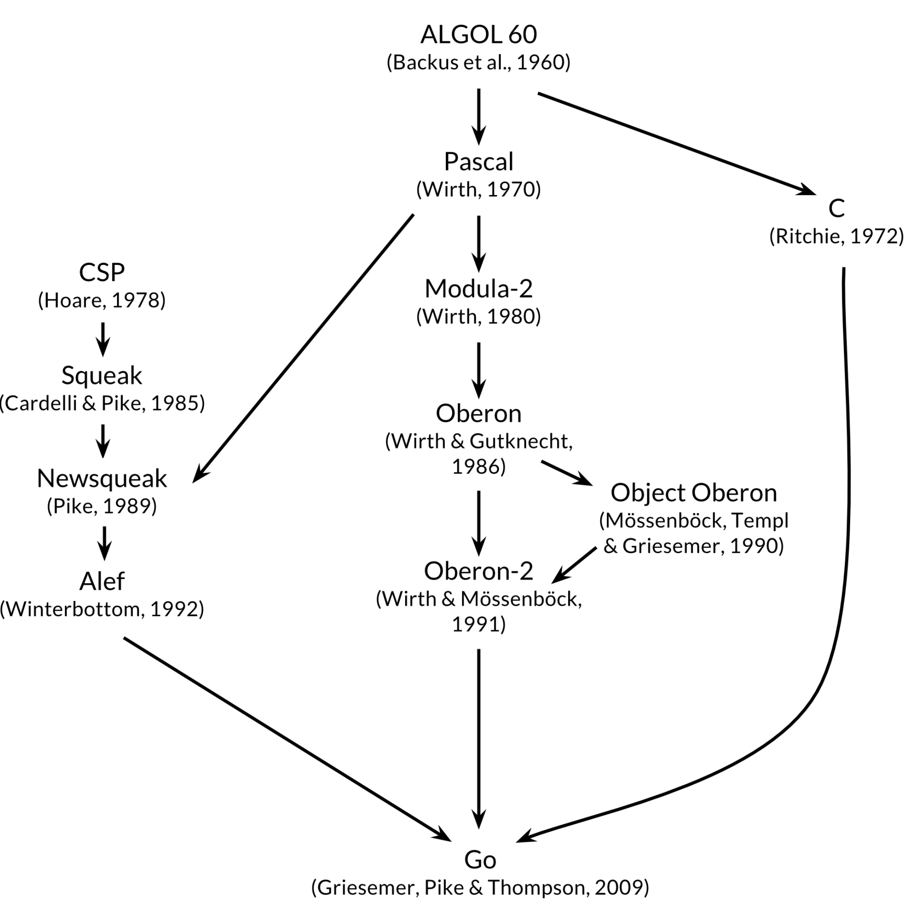

# Interfaces in Go: where, why and when to use it

This is a talk given by [Urick Loureiro](https://github.com/uloureiro) on 23/02/2022.

## Go: a brief introduction

The Go Project is an effort towards making the process of building modern apps simpler, clearer and more efficient, while leveraging the potential of recent hardware/cloud multi-core architecture and bringing solutions to older programming challenges.

<p align="center">
  <br>
  <i>Gopher by <a href="https://instagram.com/reneefrench">Renee French</a></i> <a href="#references">[1]</a>
</p>

> The Go project was born of frustration with several software systems at Google that were suffering from an explosion of complexity. [[2]](#references)

> Go is a programming language designed by Google to help solve Google's problems, and Google has big problems. [...] The goals of the Go project were to eliminate the slowness and clumsiness of software development at Google, and thereby to make the process more productive and scalable. The language was designed by and for people who write—and read and debug and maintain—large software systems. [[3]](#references)

<p align="center">
  <br>
  <i>DONOVAN, KERNIGHAN, 2015</i> <a href="#references">[2]</a>
</p>

---

### Productivity proven at scale

- Convention over configuration
- Concise type system (15, in fact!)
  - int, float, complex, byte, rune, string, bool, array, struct, slice, map, pointer, function, interface and channel
- Easily distributable

> Go is a language that focuses on code being readable as a first principle. [[4]](#references)

> Gofmt's style is no one's favorite, yet gofmt is everyone's favorite. [[1]](#references)

> If you've ever spent a week planning your abstract classes and interfaces in a complex Java or C++ program, you'll appreciate the simplicity of Go's type system. [[5]](#references)

---

### Performance as one of its priorities

- Efficient multiplatform compiler
- Efficient garbage collector
- Built-in concurrency (goroutines cost less than an OS thread)

> It's a fast, statically typed, compiled language that feels like a dynamically typed, interpreted language. [[6]](#references)

> Here is the key, Go gives me direct access to the machine while still providing abstraction mechanisms to allow higher-level ideas to be expressed. [[4]](#references)

> Go offers lightning-quick compiles by using a smart compiler and simplified dependency resolution algorithms. [...] The entire Go source tree compiles in under 20 seconds on modern hardware. [[5]](#references)

> Go's concurrency support is one of its strongest features. Goroutines are like threads, but use far less memory and require less code to use. [[5]](#references)

---

### Built-in tooling and standard library

- Formatting, testing, benchmark, profiling, and more, all included
- Standard library has lots of useful packages
- Dependencies are easily added and managed (built-in package manager)
- Language is actively improved: [https://go.dev/project](https://go.dev/project)

> Go's standard library, often described as coming with "batteries included", provides clean building blocks and APIs for I/O, text processing, graphics, cryptography, networking, and distributed applications, with support for many standard file formats and protocols. [[2]](#references)

## Before cracking into interfaces

Go _is_ an object-oriented language and its approach to achieve the well known benefits of this design methodology is very flexible and expressive. Although the focus of this talk isn't to explain each of the language's features around object-oriented programming, interfaces are of great importance in the ways of promoting decoupling and polymorphism.

It is worth mentioning that the approach Go takes towards object-oriented programming isn't the same as other languages already very well known by its object-oriented attributes. The naming patterns it uses, how much less code you need to write and the way of implementing it may be strange at first but once you get how simple and flexible it is, all the pieces start to work together.

The following resources -- and the references mentioned throughout this document -- will provide a very good starting point to learn more about how to apply object-oriented programming concepts through Go code.

> From an object oriented standpoint, Go does provides the ability to add behavior to your types via methods, allows you to implement polymorphic behavior via interfaces and gives you a way to extend the state and behavior of any existing type via type embedding. Go also provides a form of encapsulation that allows your types, including their fields and methods, to be visible or invisible. Everything you need to write object oriented programs is available in Go. _[(Object Oriented Programming Mechanics. KENNEDY, Bill.)](https://www.ardanlabs.com/blog/2015/03/object-oriented-programming-mechanics.html)_

[Object Oriented Programming in Go. KENNEDY, Bill.](https://www.ardanlabs.com/blog/2013/07/object-oriented-programming-in-go.html)

[Golang UK Conference 2016 - Dave Cheney - SOLID Go Design (video)](https://www.youtube.com/watch?v=zzAdEt3xZ1M)

## Interfaces

- Gives the ability to data exhibit **behavior**
- Implicitly satisfied
- It is a type, but represents no (concrete) value

> When you have a value of an interface type, you know nothing about what it is; you know only what it can do, or more precisely, what behaviors are provided by its methods. [[2]](#references)

> Interfaces should describe behavior and not state. They should be verbs and not nouns. [[4]](#references)

> Interfaces allow me to group concrete data together by what the data can do. [[4]](#refrences)

```go
type bicycler interface {
    pedal() string
}
```

### Implicitly satisfied

> A type satisfies an interface simply by implementing its methods. There is no "implements" declaration; interfaces are satisfied implicitly. It's a form of duck typing, but (usually) checkable at compile time. An object can (and usually does) satisfy many interfaces simultaneously. [[7]](#references)

```go
package main

import "fmt"

func main() {
  rb := roadBike{}
  fmt.Println(rb)
}

type bicycler interface {
    pedal() string
}

type roadBike struct{}

func (rb roadBike) pedal() string {
	return "Pedaling on a road bike."
}

// String implements https://pkg.go.dev/fmt#Stringer.
// Note how no additional reference to Stringer have been added to make it work.
// func (rb roadBike) String() string {
//   return rb.pedal()
// }
```

### Polymorphism at ease

> Polymorphism means that you write a certain program and it behaves differently depending on the data that it operates on. [[8]](#references)
> _KURTZ, Tom (inventor of BASIC)._

Because Go is convention over configuration, and, as we have seen, it implicitly satisfies interfaces, implementing polymorphism is easy.

```go
package main 

import "fmt"

func main() {
  rb := roadBike{}
  // fb := fakeBike("fake bike")
  fmt.Println(ride(rb))
  // fmt.Println(ride(fb))
}

type bicycler interface {
    pedal() string
}

// ride is a polymorphic function because it asks for an interface type, thus it 
// is requiring data not by what it is but by what it does.
func ride(b bicycler) string {
	return b.pedal()
}

type roadBike struct{}

func (rb roadBike) pedal() string {
	return "Pedaling on a road bike."
}

type fakeBike string // named type

func (fb fakeBike) pedal() string {
  return "Pedaling on a fake bike."
}
```

### Embeddable for high flexibility

```go
package main 

import "fmt"

func main() {
	rb := roadBike{}
	fmt.Println(ride(rb))
	fmt.Println(play(rb))
	fmt.Println(rideLoudly(rb))
}

type bicycler interface {
	pedal() string
}

type ringer interface {
	ring() string
}

type bicyclerRinger interface {
	bicycler
	ringer
}

func ride(b bicycler) string {
	return b.pedal()
}

func play(r ringer) string {
	return r.ring()
}

func rideLoudly(br bicyclerRinger) string {
  // I could have called br.ring() and br.pedal() directly but I've used the
  // polymorphic functions to demonstrate the concept of implicit interface
  // conversion.
  return fmt.Sprintf("%s %s %s", play(br), ride(br), "Very loudly.")
}

type roadBike struct{}

func (rb roadBike) pedal() string {
	return "Pedaling on a road bike."
}

func (rb roadBike) ring() string {
	return "RING RING RING!"
}
```

### Type assertion for more powerful APIs

Go allows inferring, at runtime, if the underlying concrete data of an interface implements a different behavior not mapped by that interface. It opens a possibility to **deviate logic based on behavior**. This sort of behavior is also known as parametric polymorphism.

It is important to bear in mind that this operation is done in runtime, thus via reflection, so using this feature will not allow taking advantage of the static code analysis provided by the compiler. There are ways to use it safely though.

```go
package main

import "fmt"

func main() {
  cb := cityBike{}
  fmt.Println(rideAtNight(cb))
}

type bicycler interface {
  pedal() string
}

type lightener interface {
  flash() string
}

type cityBike struct {}

func (cb cityBike) pedal() string {
  return "Pedaling on a city bike."
}

// Uncomment this func to see the behavior deviating from rideAtNight().
// func (cb cityBike) flash() string {
//   return "SWOOSH!"
// }

func rideAtNight(b bicycler) string {
  l, ok := b.(lightener) // the second returning argument allows safe usage
  if !ok {
    return b.pedal()
  }

  return fmt.Sprintf("It is dark, then let there be light: %s %s", l.flash(), b.pedal())
}
```

This can be specially useful when you want to allow the users of your API to provide overridable behavior to your implementation. A good example for that is present in the standard library with the [`WriterTo`](https://pkg.go.dev/io#WriterTo) interface.

### Testing against external dependencies

```go
package main

import (
	"testing"
)

type paymentProcessor interface {
	Authorize(amount float32) bool
}

// Pretend that a third-party library provides an API that implements paymentProcessor.
// This would be the ideal world, so you don't have to rely on the third-party concrete
// value but your self defined interface implicitly satisfied by an external library.
func purchaseBike(p paymentProcessor, amount float32) bool {
	return p.Authorize(amount)
}

type mockPaymentProcessor struct {
	wantResponse bool
}

func (mpp mockPaymentProcessor) Authorize(amount float32) bool {
  // more logic could be added if necessary
	return mpp.wantResponse
}

func Test_purchaseBike(t *testing.T) {
	t.Run("payment not authorized", func(t *testing.T) {
		mpp := mockPaymentProcessor{
			wantResponse: false,
		}

		if purchaseBike(mpp, 2000.00) != false {
			t.Error("expected payment to be rejected")
		}
	})
	t.Run("payment authorized", func(t *testing.T) {
		mpp := mockPaymentProcessor{
			wantResponse: true,
		}

		if purchaseBike(mpp, 2000.00) != true {
			t.Error("expected payment to be authorized")
		}
	})
}
```

## When to use interfaces

Sometimes it is more significant and relevant to know when not to do something than to know when to do it, so here are some thoughts about when not to use interfaces (or at least think more about it before using):

- Never start your development/design defining interfaces, discover them as part of the evolution of the program instead
- Using interfaces has a cost at run-time (Go has to create a control structure internally to handle it and its implementations), so be wise about your design decision
- Don't use it just for mocking
- Don't use it "just because". Again, interfaces has a cost at run-time and a meaningless abstraction just creates more complexity

Some general guidelines pointing to a good usage of interfaces are:

- Behavior that was identified as very likely to change are good candidates to be abstracted as one or more interfaces
- When the implementation details of a given behavior are better handled by the user other than the application itself
- When the application needs to handle multiple implementations one or more interfaces would help decoupling different behaviors making it more flexible and less prone to cascading effects due to changes

## Common mistakes and how to avoid them

#### Returning interface values instead of concrete values

Because interface types are valueless types (it only exposes behavior, not concrete value), it is recommended to never construct an object and return it encapsulated as an interface. Interfaces are meant to serve as mechanisms that gives access to behavior, not to being transported through the call chain as values. Nonetheless, once it is necessary to access any concrete data from the underlying type a runtime inference will be necessary, which do not escalates well.

```go
package main

type bicycler interface {
	pedal() string
}

type roadBike struct{}

func (rb roadBike) pedal() string {
	return "Pedaling on a road bike".
}

func newRoadBike() bicycler { // please don't do this
	return roadBike{}
}
```

#### Creating interfaces as part of the package implementing it

Because interface are easyly defined and implicitly satisfied, there is no need to provide abstractions to your API's users. Let them create their own abstractions to your concrete implementation instead. In the vast majority of scenarios you will only have to provide the concrete implementation. Never start by designing interfaces, let them be discovered as they are (really) needed instead.

> One thing that is different about Go from other languages is the idea of convention over configuration. This really shows itself with how Go handles interface compliance. Because the compiler can perform static code analysis to determine if a concrete value implements an interface, the developer declaring the concrete type doesn't need to provide interfaces as well. [[4]](#references)

#### Be aware about value semantics and pointer semantics

Mixing out value semantics and pointer semantics can lead to confusion and cause unexpected behavior during runtime. Once using either values or pointers, stick to it unless there is a very well known reason to have both semantics for the same type.

```go
package main

import "fmt"

func main() {
	rb := roadBike{}
	mb := mountainBike{}

	fmt.Println(ride(rb))
	fmt.Println(ride(mb))
}

type bicycler interface {
	pedal() string
}

type roadBike struct{}
func (*roadBike) pedal() string {
	return "Pedaling on a road bike."
}

type mountainBike struct{}
func (mountainBike) pedal() string {
	return "Pedaling on a mountain bike."
}

func ride(b bicycler) string {
	return b.pedal()
}
```

#### An interface assigned with a nil pointer value isn't nil

This sentence was extracted from [[2]](#references).

```go
package main

import "fmt"

func main() {
	var rb *roadBike

	fmt.Println(ride(rb))
}

func ride(b bicycler) string {
	if b != nil {
		return b.pedal()
	}

	return ""
}

type bicycler interface {
	pedal() string
}

type roadBike struct {
	size string
}

func (rb *roadBike) pedal() string {
	return fmt.Sprintf("Pedaling on a road bike of size %s.", rb.size)
}
```

#### Using `interface{}` to mimic generics

For a very few set of scenarios, relying on the empty interface is a code smell -- handling all possible edge cases may become a rabbit hole as the requirements escalate. Because [the empty interface says nothing](https://go-proverbs.github.io/), avoid using it with all of your heart, otherwise really (really!) necessary.

 Real generics are coming with [Go v1.18](https://tip.golang.org/doc/go1.18). Here is a tutorial to play with it: https://go.dev/doc/tutorial/generics.

#### Relying heavily on type assertions could be a code smell for bad design

Like using `interface{}`, relying heavily on type assertions might be a code smell. Prefer being more expressive by exposing behavior through interfaces instead having to infer concrete types to access concrete implementation.

#### Interfaces with more than one method have more than one reason to change

This sentence was extracted from [[4]](#references).

Yet another code smell. The way interfaces are simple and implicitly satisfied gives a great opportunity to make your design cleaner. If an interface abstracts too many methods, it may be a signal that your abstraction is starting to get meaningless and that interface has multiple reasons to change. Consider rethinking the design and possibly breaking behavior in more than one interface.

## References

1. [The Go Proverbs](https://go-proverbs.github.io/). PIKE, Robert. Consulted on Feb. 06, 2021.
2. The Go Programming Language. DONOVAN, Alan A. A. KERNIGHAN, Brian W. Addison-Wesley, 2015.
3. [Go at Google: Language Design in the Service of Software Engineering](https://talks.golang.org/2012/splash.article). PIKE, Robert. Consulted on Feb. 06, 2021.
4. Ultimate Go Notebook. KENNEDY, William. AN, Hoanh.
5. Go in Action. KENNEDY, William. KETELSEN, Brian. MARTIN, Erik St. Manning Publications, 2016.
6. [go.dev](https://go.dev/)
7. [Another Go at Language Design](https://web.stanford.edu/class/ee380/Abstracts/100428-pike-stanford.pdf). PIKE, Robert. Consulted on Feb. 13, 2021.
8. Masterminds of Programming: Conversations with the Creators of Major Programming Languages. BIANCUZZI, Frederico. O'Reilly, 2009.